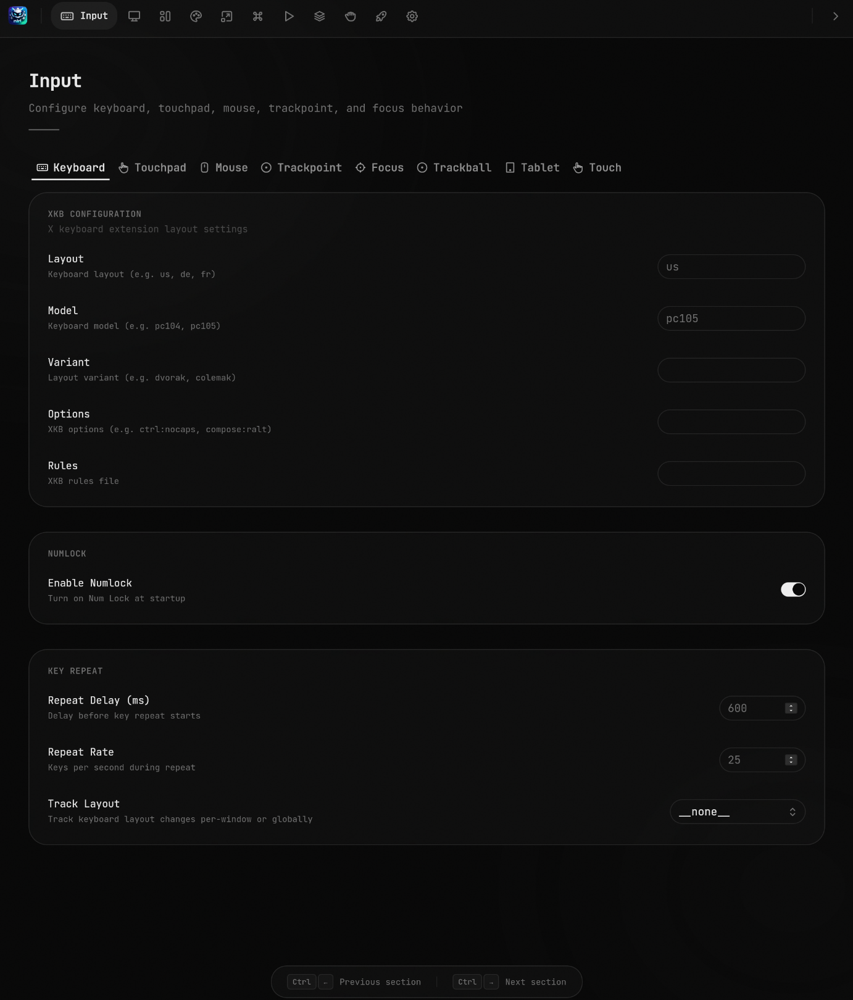

<p align="center">
  
</p>

<h1 align="center">Niri Settings</h1>

<p align="center">A graphical settings editor for the <a href="https://github.com/YaLTeR/niri">niri</a> Wayland compositor.<br/>Built with Tauri, React, and Rust.</p>

<p align="center">
  
</p>

---

## Download

Grab the latest `.deb`, `.rpm`, or `.AppImage` from [Releases](https://github.com/zakstam/niri-settings-ui/releases).

## Build from Source

```sh
git clone https://github.com/zakstam/niri-settings-ui.git && cd niri-settings-ui/niri-settings-ui && pnpm install && pnpm tauri build
```

The built binary will be in `src-tauri/target/release/niri-settings`.

## Development

```sh
pnpm install
pnpm tauri dev
```

## Tech Stack

- **Frontend** -- React 19, TypeScript, Tailwind CSS 4, Base UI
- **Backend** -- Rust, Tauri 2, KDL config parsing
- **Font** -- JetBrains Mono

## License

MIT
